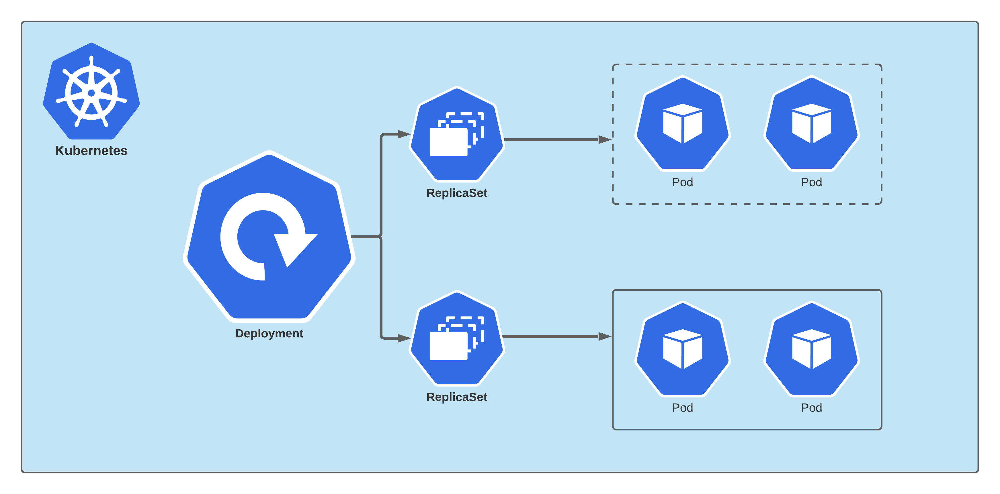

# 当你创建了一个 Deployment 时，Kubernetes 内部发生了什么？


我们通常使用 kubectl 来管理我们的 Kubernetes 集群。 当我们需要一个 Nginx 服务时，可以使用以下命令来创建：

```shell
kubectl create deployment nginx --image nginx
```

返回：

```shell
deployment.apps/nginx created
```

稍等片刻，一个包含 Nginx 容器的 Pod 就会启动成功。那么在我们执行在上述命令后，Kubernetes 内部发生了什么呢？

### 核心组件


在介绍内部发生了什么之前，我们首先需要了解一下以下 4 个核心组件在 Kubernetes 集群中的角色和作用：

* **kube-apiserver**: Kubernetes API 服务器验证并配置 API 对象的数据， 这些对象包括 pods、services 等。 API 服务器为 REST 操作提供服务，并为集群的共享状态提供前端， 所有其他组件都通过该前端进行交互。

* **kube-controller-manager**: 运行控制器进程的控制平面组件。 从逻辑上讲，每个控制器都是一个单独的进程， 但是为了降低复杂性，它们都被编译到同一个可执行文件，并在一个进程中运行，所以它会被称作为 `manager`。它包含 DeploymentController、ReplicaSetController、JobController 等一系列控制器。

* **kube-scheduler**: 控制平面组件，负责监视新创建的、未指定运行节点（node）的 Pods，选择节点让 Pod 在上面运行。 调度决策考虑的因素包括单个 Pod 和 Pod 集合的资源需求、硬件/软件/策略约束、亲和性和反亲和性规范、数据位置、工作负载间的干扰和最后时限。

* **kubelet**: 一个在集群中每个节点（node）上运行的代理。 它保证容器（containers）都运行在 Pod 中。 kubelet 接收一组通过各类机制提供给它的 PodSpecs，确保这些 PodSpecs 中描述的容器处于运行状态且健康。

### 简化的核心过程



在了解上述核心组件的角色后，我们来看一下 Kubernetes 内部到底发生了哪些事情：

1. 用户通过 kubectl 向 kube-apiserver 发起一个创建 Deployment 对象的请求。

2. kube-apiserver 在对上述请求进行认证（authn）、授权（authz）、准入（admission）、验证（validation）等一系列操作后，会创建一个 Deployment 对象。

3. 上述的 Deployment 创建事件，会被 DeploymentController 通过其内部的 DeploymentInformer 监听到，然后根据 DeploymentController 内部设定的逻辑，它将会创建一个 ReplicaSet 对象。[源码 syncDeployment](https://github.com/kubernetes/kubernetes/blob/2c0e4a232a3c10a9083012ec28a3622bd4e4be90/pkg/controller/deployment/deployment_controller.go#L566)

4. 上述的 ReplicaSet 创建事件，会被 ReplicaSetController 通过其内部的 ReplicaSetInformer 监听到，然后根据 ReplicaSetController 内部设定的逻辑，它将创建一个 Pod 对象，而此时 Pod 的 Spec.nodeName 字段的值为空；[源码 syncReplicaSet](https://github.com/kubernetes/kubernetes/blob/59e5b849c9439375575f6ced54fb9e2364b58797/pkg/controller/replicaset/replica_set.go#L650)

5. 上述的 Pod 创建事件，会被 Scheduler 通过其内部的 PodInformer 监听到，Scheduler 会根据其内部的调度算法，选择一个合适的 Node 节点，例如 node-A，并更新 Pod 的 Spec.nodeName 字段。[源码 Schedule](https://github.com/kubernetes/kubernetes/blob/2c0e4a232a3c10a9083012ec28a3622bd4e4be90/pkg/scheduler/generic_scheduler.go#L93)

6. 上述的 Pod 更新事件，会被 node-A 节点上 kubelet 感知到，它会发现自己的 nodeName 和 Pod 的 Spec.nodeName 相匹配，接着 kubelet 将按照一定的步骤顺序启动 Pod 中的容器，并将容器已启动的信息写入 Pod 的 Status 中。[源码 syncPod](https://github.com/kubernetes/kubernetes/blob/fb70ca9b7b24ce90b19b0d565ae43e6af20458ad/pkg/kubelet/kubelet.go#L1530)

如上所述，DeploymentController、ReplicaSetController 等许多独立的控制循环都是通过监听 kube-apiserver 上对象的变化进行通信，而这些变化会通过各种 Informer 触发事件，执行其对应的业务逻辑。之所以这么设计，是为了减少对 apiserver 的压力。

### kubelet 创建 Pod 的过程

Pod 的创建的过程大体上可以分为 4 个步骤（实际上为 7 步，这里省略了前置的 3 个步骤[源码 SyncPod](https://github.com/kubernetes/kubernetes/blob/0b4a793da2a2912393687367e0af2436612a9b8e/pkg/kubelet/kuberuntime/kuberuntime_manager.go#L726)）：

1. 为 Pod 创建沙盒，即基础设施容器 Infrastructure Container（镜像名称为 k8s.gcr.io/pause），它的主要作用是创建并共享进程命名空间。

2. 创建 Pod 规格中指定的临时容器 Ephemeral Containers (Alpha 功能，默认不开启)，临时容器是一种特殊的容器，该容器在现有 Pod 中临时运行，以便完成用户发起的操作，例如故障排查。 你可以使用临时容器来检查服务，而不是用它来构建应用程序。

3. 创建 Pod 规格中指定的初始化容器 Init Containers，初始化容器是一种特殊容器，在 Pod 内的应用容器启动之前运行。Init 容器可以包括一些应用镜像中不存在的实用工具和安装脚本。

4. 依次创建 Pod 规格中指定的常规容器 Containers。

### 参考

* 张磊《深入剖析 Kubernetes》
* Michael Hausenblas, Stefan Schimanski《Kubernetes 编程》
* [Kubernetes 组件](https://kubernetes.io/zh/docs/concepts/overview/components/)
* [详解 Kubernetes Deployment 的实现原理](https://draveness.me/kubernetes-deployment/)
* [详解 Kubernetes ReplicaSet 的实现原理](https://draveness.me/kubernetes-replicaset/)
* [详解 Kubernetes Pod 的实现原理](https://draveness.me/kubernetes-pod/)
* [Kubernetes CRI 分析 - kubelet 创建 Pod 分析](https://mp.weixin.qq.com/s/AG6H_mPuTu6-_ISQWu3YHw)
